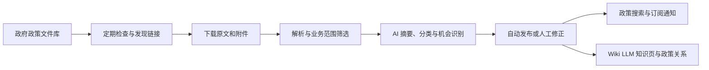

# 政策观察

面向水务、环保及“人工智能+”方向的政策发现、分析与订阅平台。系统定期检查政府政策文件库，保存政策原文及附件，提取摘要、分类和政策机会；正式发布后，用户可以搜索政策、订阅关心的主题并接收站内通知。

本仓库提供网页、API、后台任务及 Docker Compose 部署文件。默认部署适合**本机试用和受控内网验证**。首次启动使用全新 PostgreSQL 数据库，不附带管理员账号、演示政策或现成的政策数据。

## 功能概览



- **来源采集**：首次部署默认登记并启用[南宁市政策文件库](https://www.nanning.gov.cn/sousuo/zck/)。支持在网页调整检查计划、暂停来源和登记其他已支持的政策文件库。
- **政策处理**：保存原文和附件，提取政策摘要、文件类型、地域、业务领域、技术方向、政策效力与政策机会。AI 审核结果可由内部人员查看和修改。
- **审核异常恢复**：在处理工作台按原因恢复失败审核、重解析已保存的受支持附件，并查看处理记录、停止或继续任务。自动异常处理默认关闭，可在“系统配置 → AI 模型与审核”开启并设置每日额度、尝试上限和冷却时间；缺少原件或解析能力时给出人工处理提示。
- **搜索与订阅**：已发布的政策可按关键词、自然语言及结构化条件检索；用户无需订阅也能搜索正式政策库，订阅用于接收匹配通知。自然语言回答以库内真实政策为依据。
- **政策知识**：发布后的政策可参与 Wiki LLM 知识页综合和关系构建；内部人员可以查看证据并复核有争议的关系。关系复审支持单条／批量补查原文证据、重新校验及停止任务，保存有效关系后更新受影响知识页。
- **系统配置**：从管理页面设置政策文件库、分类和识别规则，以及不同用途的 AI 模型。
- **人工质量评测**：内部人员在“质量评测 → 政策质量”准备材料，左右对照原文填写判断、选文引用并连续保存；拿不准的材料单独进入待协助列表。报告展示判断一致、不一致、漏判和误判，评测不会改写正式政策。
- **企业持续匹配**：确认企业画像后，可在“订阅与消息 → 按企业／项目订阅 → 持续关注政策条件变化”关注企业或项目，选择更新频率与可选 AI 解读。首次建立当前结果，后续实质变化通过站内通知提醒；支持关闭关注、查看原文依据及反馈。管理员在“系统配置 → 持续推荐”控制企业范围、处理额度和保留期限。
- **匹配核验与运行观察**：在“质量评测 → 企业匹配核验”选取企业或项目，建立一组推荐与未推荐样本，查看冻结全文后标注相关／不相关／无法判断，检查误推和漏判。仅本人且仍有企业权限时可见，每组 4～40 份，每天最多 5 组。指标只代表已标注样本，不代表全库准确率或申报资格；抽样不调用模型。管理员可在“系统配置 → 持续推荐”查看实时及每小时运行记录，无样本时明确显示暂无数据。

## 技术组成

| 组件 | 用途 |
| --- | --- |
| Next.js | 客户工作台和内部管理页面 |
| Django REST Framework | 用户、来源、政策、订阅及配置 API |
| PostgreSQL | 账号、政策、处理结果和业务配置 |
| Redis + Celery | 采集、解析、AI 审核及定时任务 |
| LangGraph | AI 分析流程及检查点 |
| OpenSearch（可选） | 全文检索索引；默认可使用数据库搜索 |
| 本地文件目录或对象存储 | 政策原文和附件 |

## 快速开始：从空数据库部署

### 1. 准备环境

安装并启动 Docker Desktop（Windows/macOS）或 Docker Engine（Linux），确认 `docker compose` 可用。还需要 Git 和 Python 3；Python 只用于生成本机配置、运行备份脚本，应用本身在容器里运行。首次构建需要下载镜像和依赖。

```bash
docker version
docker compose version
python --version
```

Windows 上如果 `python` 不可用，可将下文的 `python` 换为 `py`。

### 2. 获取代码并生成本机配置

```bash
git clone https://github.com/JiaHN213/policy-platform.git
cd policy-platform
python scripts/prepare_compose.py
```

脚本根据 [`.env.example`](.env.example) 生成 `.env.compose`，并为数据库和 Django 生成随机密钥。已有 `.env.compose` 时脚本不会覆盖它。

可以先不配置 AI，完成部署后再从网页配置。若希望尽快开始 AI 审核，可在 `.env.compose` 中填写模型服务信息：

```dotenv
AI_BASE_URL=https://api.deepseek.com
AI_API_KEY=你的密钥
AI_MODEL=你的模型名称
```

不同用途的模型还可以在“系统配置 → AI 模型与审核”中分别设置。没有可用模型时，采集和普通浏览仍可运行，AI 摘要、自动审核、自然语言归纳及知识综合等能力会受限。

本机使用 Ollama 时，容器中的 `localhost` 并不是你的电脑。在 Docker Desktop 中可将地址设为 `http://host.docker.internal:11434/v1`，模型名设为本机已安装的模型名，并填写一个非空的本地占位 `AI_API_KEY`；同时确认 Ollama 允许容器访问。Linux Docker Engine 需要先确保容器能解析并访问宿主机地址。模型地址、接口格式和可用性取决于你所使用的模型服务。

### 3. 启动服务

```bash
docker compose --env-file .env.compose config --quiet
docker compose --env-file .env.compose up --build -d
docker compose --env-file .env.compose ps
```

首次启动会构建镜像、创建 PostgreSQL 数据卷、执行数据库迁移，并登记**南宁市政策文件库**作为默认来源。该来源默认启用，检查间隔为 24 小时；后台定时服务启动后会安排首次检查。重复启动不会重复创建来源，也不会覆盖在网页中修改过的来源配置。采集进度取决于来源网站的可访问性和待处理文件量。

打开 [http://127.0.0.1:8080](http://127.0.0.1:8080)。接口健康状态可在 [http://127.0.0.1:8080/api/v1/health](http://127.0.0.1:8080/api/v1/health) 查看；正常时返回数据库已连接。默认 Compose 仅将网页端口绑定到本机，同事无法直接从局域网访问。

### 4. 创建管理员并登录

```bash
docker compose --env-file .env.compose exec api python apps/api/manage.py createsuperuser
```

按提示设置用户名、邮箱和密码，然后从网页的登录页进入。管理员可访问内部管理页面；普通客户可在登录页自主注册。首次部署**不会创建默认密码或演示账号**。

### 5. 从来源到第一条可搜索政策

1. 进入“系统配置 → 政策文件库”，确认南宁市政策文件库已启用，并按需要调整自动检查时间。
2. 进入“来源采集”，查看文件库检查、发现的链接、下载及解析状态。若来源网站不可访问，先解决网络问题再从网页重试。
3. 在“系统配置 → AI 模型与审核”填写并核对模型。进入“处理工作台”，点击“开始自动审核”；**网站启动不会自动开启 AI 审核**。
4. 在“处理工作台”查看 AI 处理结果。符合发布条件的政策会自动发布；资料或证据不足的文件可在此查看原因并修正。
5. 已发布政策会进入客户的“最新政策”和“政策搜索”。客户可以在“订阅与消息”保存条件，并在“消息通知”查看匹配结果。

新数据库一开始没有政策，因此搜索为空是正常的。来源检查、解析、AI 审核与发布都完成后，才会出现正式搜索结果。政策关系和知识页属于发布后的后续处理。

## 页面导览

| 使用者 | 页面 | 主要用途 |
| --- | --- | --- |
| 客户 | `/home` 首页 | 相关机会、信息不足线索、截止提醒和待确认资料；无画像时浏览最新政策 |
| 客户 | `/search` 政策库 | 关键词／自然语言、政策／机会双视角检索；最新发布为同一入口的另一标签，兼容 `/policies` |
| 客户 | `/policies/{id}` 政策详情 | 从快速查看进入全文、附件、条件和已核验关联政策 |
| 客户 | `/enterprise` 企业与项目 | 提供资料并确认画像，维护项目；相关政策列表位于 `/home/matches` |
| 客户 | `/subscriptions` 订阅与消息 | 按企业／项目预填并预览，确认订阅；保留自定义规则及提醒，兼容 `/notifications` |
| 业务运营 | 日常处理 | `/admin/review` 待办与审核、`/admin/sources` 采集、`/admin/data` 政策数据 |
| 业务运营／研究 | 知识与质量 | `/admin/knowledge` 知识阅读、`/admin/quality` 质量评测；企业核验另需成员授权 |
| 系统管理 | 系统维护 | `/admin/monitor` 运行监控、`/admin/publication` 发布后处理、`/admin/configuration` 配置 |

客户只看业务结果、来源依据和重要限制，不展示AI执行步骤、Token、模型费用、采集积压或抽样评测。客户不订阅也能搜索正式政策。快速查看之后可进入完整政策详情，筛选默认折叠，可按需展开。申报书生成暂未实现。

**内部权限：** 业务运营身份为员工，政策写操作仍校验相应业务权限。系统管理另要求 `accounts.manage_system`（“管理系统配置与运行监控”），超级管理员自动满足；已有普通员工不会因升级自动获得该权限。可由超级管理员在 Django 管理后台的用户权限或权限组中授权。系统管理权限不授予企业私有资料权限。

## 界面截图与功能说明

[点击查看系统界面展示](docs/界面展示.md)，浏览客户工作台、内部管理页面及各页面功能截图；也可以[查看 PDF 版本](docs/界面展示.pdf)。

API 文档位于 [http://127.0.0.1:8080/api/docs/](http://127.0.0.1:8080/api/docs/)。

### 按企业或项目订阅

在“订阅与消息”先选企业、再选企业整体或具体项目。系统展示按已确认业务领域和关注地区生成的规则；点击“预览此领域”只查看匹配结果，点击“确认开启订阅并跟随资料更新”才保存。资料版本变化时须刷新预览再确认。手工修改、关闭或删除的规则继续受保护。

“停止资料跟随”只停止自动调整规则，不停止已有提醒；停收请关闭下方对应订阅。自定义订阅仍可使用，高级条件默认收起。

### 企业画像与政策匹配

**新用户快速开始：** 注册成功后进入可跳过的企业信息引导。搜索服务可用时只需填写企业全称，也可以提供官网、上传介绍或粘贴简介。AI 自动整理信息，单一企业候选直接展示精简确认表，多家候选则先选择正确企业。确认时可勾选“帮我订阅与企业业务相关的政策”，一次保存画像与订阅，无需再填写订阅条件。不勾选就只保存画像；跳过仍能搜索全部正式政策，之后可在“企业与项目”补充。

自动订阅按已确认的每个业务领域各生成一条“政策与机会”规则，规则之间为任选命中；不会用企业所在城市限制政策发布地区，避免漏掉国家和省级政策。后续政策更新通过站内通知提醒，可在“订阅与消息”修改或关闭。同一用户相同领域的自动订阅及等价手工规则会复用，已暂停或修改的自动规则不会被覆盖。没有业务领域、无订阅权限或额度不足时保留画像并说明原因，不创建无条件订阅。画像后续修改不会自动删除或重写已有订阅，需显式再次勾选以补充新增领域；历史政策可在政策匹配中查看，不会补发全部历史通知。

客户打开“企业与项目”，填写企业全称，再选择方便的方式提供资料：

| 方式 | 企业需要提供什么 | 是否需要搜索密钥 |
| --- | --- | --- |
| 填写官网 | 官网或企业介绍页面地址，自动读取首页及少量同站业务、介绍、案例页面 | 不需要 |
| 上传介绍 | PDF、DOCX、PPTX、TXT 或 Markdown 文件，最大 5MB | 不需要 |
| 粘贴简介 | 复制已有企业介绍，20–40,000 字 | 不需要 |
| 联网搜索 | 企业全称，可补充城市、信用代码以区分同名企业 | 本地 SearXNG 无需密钥；Tavily／Brave Search API 需密钥 |

以上方式均使用已配置的画像模型生成带引用依据的草稿，企业核对或修改后保存，才用于政策匹配。没有模型也可“直接填写画像”。已有企业点击“补充或更新资料”即可换一种方式补充。介绍文件和粘贴内容不会发送给搜索服务，只交给配置的模型处理；上传文件随整理任务保存在数据库中，普通用户无法读取其他用户的任务或材料。

官网提取最多读取 5 个页面，遵守网站自动访问规则，不访问内网地址或绕过登录。动态页面、禁止自动读取的网站及扫描件可能读不到文字，此时请提供文字版介绍或粘贴简介。长材料会限量提取并显示提示，资料不足的字段留空。

- **联网搜索配置**：管理员在“系统配置 → 企业资料搜索”选择本地 SearXNG，或填写 Tavily／Brave Search API 密钥。SearXNG 部署方式见下文，保存后可“测试连接”和“测试搜索”；API 密钥不会返回客户端。Tavily 使用返回的网页正文或摘要，Brave API 使用搜索摘要；SearXNG 对前两个有效结果尝试读取正文，失败时保留搜索摘要并提示核对。这些资料均须企业确认，不能当作工商认证。服务商文档：[Tavily Search](https://docs.tavily.com/documentation/api-reference/endpoint/search)、[Brave Search](https://api-dashboard.search.brave.com/api-reference/web/search/get)。
- **模型配置**：在“AI 模型与审核 → 企业画像与匹配解读”独立配置模型。企业公开资料只依据实际检索材料提取；没有来源的字段留空。AI 服务不可用时仍可手动建档与匹配。
- **项目**：一家企业可以添加多个拟申报项目。用一句话描述计划，AI 生成名称与标签草稿，核对后保存；公开历史业绩不会自动变成拟申报项目。项目描述只发送到配置的模型服务，不发送到网页搜索服务。
- **匹配**：使用已确认的企业或项目标签，对已发布的正式来源政策做相关度排序，输出高相关、中相关、低相关或信息不足。过滤失效、废止、替代、征求意见政策；机会视角同时过滤已截止等状态，批次截止时间在查询时重新计算。企业注册地、资格、营收等不能可靠判定的条件保留为待核对项，不承诺具备申报资格。AI 解读另行引用政策原文，可以直接打开全文。
- **维护**：官网和搜索方式可以选择每周、每月、每季度检查，默认仅手动检查；后续沿用确认的资料来源。上传和粘贴方式由企业主动补充，不会自动改用联网搜索。新资料产生草稿，逐项采用后才更新画像；人工确认值不会被自动覆盖。后台保存处理记录，关闭网页后可从首页的“待确认资料与可查看结果”找回已完成的内容。同一请求24小时内复用结果，后台可限制每日调用次数。

运行后台 worker 和 beat 才能处理资料整理及定期更新。升级时正常执行数据库迁移，新增企业表不会清空已有政策、账号或原文。搜索未配置时，界面会明确提示，系统不会伪造企业资料。

确认画像后可直接查看初步政策机会，并填写多个企业或项目关注地区。勾选“以后自动跟随画像调整订阅”后，系统只更新自动管理的领域规则；你手动修改、关闭或删除的规则会保留。在“订阅与消息 → 订阅管理 → 变更记录”可查看调整原因并恢复旧设置。

**项目专属订阅：** 在“企业与项目”的项目卡片点击“订阅设置”，到订阅页面预览并确认。每个项目分别按自身业务领域和关注地区生成规则，项目修改后由后台定期同步；不会混入企业的其他业务领域。手工修改、关闭和删除的规则不会被自动覆盖。点击“停止资料跟随”只停止自动调整，已有订阅仍保留，停收请到“订阅与消息”关闭。删除项目会同时删除该项目的专属订阅与关注记录。

“订阅与消息 → 提醒时间与通知偏好”可设置站内提醒：普通更新默认每天北京时间 09:00 汇总，可修改时间或选择即时通知；延期、暂停和政策效力变化单独提醒。截止提醒可选开启，默认提前 7 天和 1 天。只有明确截止日期且符合订阅的有效批次才会提醒。当前仅站内通知，没有发送邮件或短信。

Compose 默认分开运行三个后台服务：`ingestion` 负责政策采集与原件解析（1 个执行槽），`worker` 负责 AI 审核、企业研究、Wiki 等业务（2 个执行槽），`notifications` 负责通知（1 个执行槽）。采集响应慢时不会占用 AI 的执行槽，但它们仍共享机器、数据库和 Redis，不是完全独立的硬件资源。网站限速、冷却、断点和模型并发限制继续生效。

部署或更新时需同时保留 `worker`、`ingestion`、`notifications` 和定时调度 `beat`；不要只启动网页和 API。在“运行监控 → 后台运行状态”可查看三个处理环节是否响应，点击“重新检查”刷新。显示“待确认”可能是服务未启动，也可能是繁忙或通信超时；服务已响应也不等于 AI 模型和政府网站可访问。内部“运行监控 → 来源更新情况”展示已接入来源和处理延迟，24 小时是建设目标，不是时效承诺。

从旧版升级时，先暂停 `beat`，查看 `worker` 和 `notifications` 的活跃任务，待任务完成后执行平常的 Compose 更新命令（开发模式需叠加 `compose.dev.yaml`）。**环境变量改变必须重新创建容器，只有 `restart` 不够。** 不要删除 Redis 队列；旧队列中的任务仍由原业务 worker 处理。新任务自动进入独立采集队列。非 Docker 部署默认仍共用 `celery` 队列；手动设置 `CELERY_INGESTION_QUEUE` 后必须启动监听同名队列的采集 worker。

**企业／项目政策匹配：** 确认画像后进入“政策匹配”，可切换企业与项目、政策与机会视角，按关键词、发布城市、机会类别、相关度及排序筛选。系统结合标签与全文词查找线索；只对原文完整、含义明确的硬条件比较“相符／冲突／信息不足”。明确冲突默认隐藏，可勾选查看；资料缺失仍保留。展开条件即可查看原文依据，并按需补充最多两项信息，保存后重新匹配。

“AI 解读匹配依据”按需读取正文及已解析附件中的相关片段，展示引用和原文位置；长文会注明仅分析部分内容。AI 新发现的条款先列为待核对，不直接改写机会或作资格认定。企业可补充主体类型、注册城市及指定年度营收，项目另填阶段和总投资（万元）。企业与项目分别保存，政策、批次或画像发生变化时需重新分析。没有配置模型时，基础匹配与条件对照仍可使用。

**有限资料补查 Agent：** 在“系统配置 → 企业资料搜索 → AI 资料补查”开启有限补查，可选择“向所有企业开放”，或只指定部分已建档企业。向所有企业开放后，现有企业、新增企业和新用户首次整理资料均可使用，无需逐个加入名单。系统按缺口选择已有官网链接或材料片段继续读取；客户只查看整理结果，过程、预算和控制在内部本人任务处理中查看。默认最多读取 3 次、调用模型 7 次、时间预算 480 秒；管理员可修改。上传、粘贴方式不会自动联网搜索，所有结果仍是待确认草稿。关闭有限补查后，新任务回到原流程。全新部署默认关闭，管理员按需开启；开放功能不授予其他企业的数据权限。

补查任务在恢复与确认时核对画像和配置版本，避免覆盖新修改。停止不会强制断开已发出的模型请求，但迟到结果不会应用。模型调用在 PostgreSQL 中按服务主机和端口共享 `AI_REVIEW_CONCURRENCY` 容量，各用途同时受网页配置的并发数限制；同一服务请使用统一地址。尚未完成大样本质量评测，建议先小范围核对真实材料效果。

### 内部任务管理与客户结果

**自动补资料与减少重复调用：** 自动匹配会识别最多两项资料缺口，按企业原先选择的官网、搜索或已确认上传／粘贴材料补查，仅提供带原文依据的缺失字段建议。在任务内点击“核对补查建议”，逐项采用并保存后，系统基于新画像重新匹配，保留原来的项目和筛选范围；本次后续任务不再重复自动补查。营业收入、项目投资与实施阶段等不从公开简介猜测，需企业自行补充。没有可用原资料时会说明原因，不会擅自改用其他搜索方式。

相同用户、画像、项目、政策、分析规则和模型配置均未变化时，可复用最近24小时的有效解读；不跨用户复用，复用记录也会再次检查政策是否更新或撤回。超时、暂时断连和服务繁忙默认最多自动重试2次，分别至少等待30秒和60秒；失败调用仍计入预算。证据不充分、权限或资料变化不做这种自动重试。

“系统配置 → 企业公开资料搜索 → 自动匹配与解读”可设置自动补查开关、最大并行解读数（1～3，默认1）、复用时长（0～72小时，0为关闭）、重试次数（0～3）和每用户每日调用上限（默认40）。实际并行度仍受后台 worker 数量和模型共享并发限制；目前默认 worker 有两个执行进程，设置3不代表同时获得三个模型执行槽。所有子任务继续共用主任务预算，恢复不重置；每日限额仅统计本自动匹配流程，不包含用户单独发起的其他用途模型任务。

**自动串联流程：** 企业资料整理 → 用户确认画像 → 检索正式政策库 → 条件过滤和相关度排序 → 逐份 AI 解读 → 查看原文与分析依据。

确认画像时可勾选“确认后自动查找并解读相关政策”（模型可用时默认勾选，可取消）；已有画像或项目，在相关政策列表点击“获取相关政策分析”。关闭页面不影响后台任务。默认选取最多 3 份高／中相关、无明确条件冲突的政策，沿用当前关键词、地区、类别、相关度和排序。没有候选时不调用模型，订阅和持续关注仍由用户单独选择。

客户可从首页查看可用的政策适用分析和全文。内部本人任务处理中集中展示每份政策进展。“停止自动匹配”会停止后续工作；“继续未完成的分析”核对权限和版本后只重试未完成部分。成功的子任务不重复执行，未完成的子任务可能重新调用模型。默认整个流程共用 6 次模型请求、480 秒累计分析时间预算，恢复不重置额度。管理员可在“系统配置 → 企业公开资料搜索 → 自动匹配与解读”修改这些上限；已发出请求可能超过时间预算后才结束。

系统管理员在“运行监控 → 本人任务处理”集中查看自己发起且仍有资料权限的企业资料整理、项目整理和政策匹配解读，可按类型和执行状态筛选。“查看任务过程”展示当前步骤、已记录的执行过程，以及关联模型请求的耗时、Token 和估算费用；“查看结果”回到原有草稿或解读展示，画像仍需核对后保存。

“运行监控”提供全平台脱敏“任务运行看板”：选择今天或最近 7／30／90 天，查看状态数量、平均完成耗时、失败率、模型请求和失败次数、解读复用数量、等待自动重试数量，以及每日创建趋势和常见失败原因。点击状态卡片筛选下方明细，再打开任务过程查看原因、停止或继续可恢复的任务；看板每 15 秒更新，明细每 5 秒更新，也可手动刷新。

统计按主任务创建日期和任务类型选取范围，调用包含这些主任务及其子任务截至当前的记录，父子任务不重复计数。平均完成耗时包含排队和重试，缺少结束时间的旧记录不纳入平均；失败率为失败数除以完成与失败之和，不含停止和处理中。复用率表示完成解读中的历史复用比例，不代表当前政策仍有效或模型准确率。全平台看板只提供脱敏聚合与任务标识，不返回企业名称、输入正文或原始错误；本人任务处理仍限定任务归属，不开放其他客户私有资料。该看板不汇总政策采集、审核或 Wiki 任务；请求记录不等于供应商账单。

系统管理员可停止本人且仍获授权的运行任务。有限资料补查支持“从保存进度继续”；项目整理、匹配解读等显示“重新执行此任务”，保留任务与调用历史，但可能产生新的模型请求。恢复会核对企业权限、画像／项目／政策版本、配置及恢复次数，依据已变化时提示新建任务。停止不会强制断开已经发出的请求，迟到结果不会应用。

只展示本人且仍有权限访问的任务；历史未记录的步骤和用量不会补造。本入口尚不包含持续推荐、Wiki 或政策审核任务，也不会自动替用户订阅。

## 常用配置

管理员在“系统配置”中还可使用以下运行管理功能：

- **AI 模型与审核 → 各用途模型配置：** 可填写每百万 Token 的输入、输出单价及币种；更换模型时需核对单价。
- **AI 用量：** 查看最近 30 天各用途和模型的请求次数、耗时、供应商返回的 Token 数与估算费用。重试分别计数，未返回的用量保持未知，未配置单价不估算费用；不同币种分别显示。这是接入后的运行统计，不是供应商账单，事务回滚或记录失败可能造成缺失。“收到响应”也不等于业务审核通过。
- **全过程追踪：** 查看最早 100 条未发布链接或最近 100 条链接的发现、解析、当前版本审核、发布及首次站内通知时间。超过 24 小时的待处理项会提示；旧数据缺失时间不倒推，没有匹配订阅时可以正常完成而不生成通知。此页不是全库报表，通知时间不代表用户已读。 点击政策名称或“查看原因与处理”，可在当前文件的抽屉中查看中文原因、全文和附件，重新解析、核对修改、重新审核、查看异常恢复记录或重试发布后的单个环节。重试沿用来源冷却、审核开关和发布校验，不会自动批量重跑。

`.env.compose` 只保存在部署机器上。大部分业务设置可以在网页调整；修改环境变量后，重新启动相关容器使其生效。

| 设置 | 用途 | 首次部署建议 |
| --- | --- | --- |
| `POSTGRES_PASSWORD`、`DJANGO_SECRET_KEY` | 数据库及应用密钥 | 使用配置脚本生成，不要提交到 Git |
| `AI_BASE_URL`、`AI_API_KEY`、`AI_MODEL` | 默认模型服务 | 不用 AI 时可暂时留空；不同用途也可在网页设置 |
| `ORIGINAL_STORAGE_BACKEND` | 政策原件存储方式 | 默认 `local`，存入项目目录 `.local/originals` |
| `OPENSEARCH_ENABLED` | 是否启用 OpenSearch | 默认 `false`，先使用数据库搜索 |
| `POLICY_CRAWL_MIN_INTERVAL_SECONDS`、`POLICY_CRAWL_JITTER_SECONDS` | 对来源站点的请求间隔 | 保持默认限速，避免对来源造成过大压力 |
| `POLICY_CRAWL_PROXY_URL` | 特殊网络环境下的采集代理 | 仅在确有需要时设置 |
| `CSRF_TRUSTED_ORIGINS`、`DJANGO_ALLOWED_HOSTS` | 允许访问的域名 | 本机部署保留默认；换域名时同步调整 |

政策分类词典、业务范围和规则的代码基线位于 [`configs/`](configs/)；管理页面发布的修改会保存在数据库中。默认支持的来源采集类型有各自适配规则，新增其他政府网站前，应先确认系统是否支持该站点的页面结构。

### 可选：启用 OpenSearch

默认不需要 OpenSearch。需要单独的搜索索引时，将 `.env.compose` 中的 `OPENSEARCH_ENABLED` 设为 `true`，再运行：

```bash
docker compose --env-file .env.compose --profile search up --build -d
```

已有政策的索引可在管理页面检查和重建，后续发布内容由后台同步。

开发模式请继续带上 `-f compose.yaml -f compose.dev.yaml`，避免切换成另一种运行方式。若本机 9200 端口被占用，可在 `.env.compose` 设置 `OPENSEARCH_HOST_PORT=9201`；容器内部仍使用 `http://opensearch:9200`。更改启用开关后需重新创建 API、worker 和 beat 容器以加载环境配置，仅重启进程不会更新容器环境变量。

### 可选：本地部署 SearXNG，为企业画像联网查资料

SearXNG 聚合外部网页搜索，不需要购买搜索 API；仍需要网络连接和企业画像 AI 模型。它负责找企业公开资料，OpenSearch 负责搜本系统已入库的政策，两者用途不同。

在项目根目录、准备好 `.env.compose` 后执行：

```bash
python scripts/setup_searxng.py
docker compose --env-file .env.compose --profile web-search up -d --no-deps searxng
```

当前使用 Docker 开发模式时，第二条改为：

```bash
docker compose --env-file .env.compose --profile web-search -f compose.yaml -f compose.dev.yaml up -d --no-deps searxng
```

初始化脚本生成独立随机密钥，写入本机环境文件，并将配置模板复制到 `.local/searxng/settings.yml`；重复运行保留已有设置。镜像按摘要固定，当前对应 SearXNG `2026.9.29-4e2c1ea7f`。这是新增服务，已有系统升级还应按下文的代码更新流程重建应用并执行迁移；只启动 SearXNG 不会更新旧版本应用。

1. 管理员打开“系统配置 → 企业资料搜索”，选择 **SearXNG（本地部署，无需搜索密钥）**。
2. 服务地址填写 `http://searxng:8080`，打开“开启联网查资料”，保存设置。
3. 点击“测试连接”，再输入企业名称点击“测试搜索”。连接成功只代表容器可达，搜索返回结果才说明上游引擎当前可用。
4. 在“AI 模型与审核”配置“企业画像与匹配解读”。客户到“企业与项目”选择“联网搜索”，填写企业名称后开始整理，核对草稿再保存。

本机可打开 [SearXNG 搜索页](http://127.0.0.1:8888)，但应用容器内必须用 `http://searxng:8080`。主机端口冲突时修改 `SEARXNG_HOST_PORT`；自定义服务地址需由部署人员同步设置 `SEARXNG_URL`，重新创建 API／worker／beat 后再修改网页设置。后台拒绝未经部署配置允许的服务地址。

默认只绑定本机回环地址，不开放公网；已启用 JSON 输出，关闭面向公共实例的限流器，应用自身仍执行用户调用额度。同一公开查询在应用进程内缓存 5 分钟，测试搜索不读取该缓存。搜索只发送企业名称、城市、信用代码及官网等身份线索，不发送上传介绍、私有项目描述；这些材料仍会发送给所配置的 AI 模型。

**上游可用性：** 当前模板使用 Brave 网页搜索引擎（与付费 Brave Search API 是两个入口）。其他引擎在本次网络中出现验证码或解析失败，因此未默认启用。无 API 不等于不限量或永远稳定；遇到验证码、限流或网络失败，系统明确提示，企业可改用官网、上传介绍、粘贴简介或管理员切换 API 服务。维护人员可修改 `.local/searxng/settings.yml` 的引擎后重启 SearXNG；修改服务密钥或环境变量则需要重新创建容器。配置文件和密钥不上传 GitHub，换机器需单独备份配置或重新初始化。

官方文档：[Docker 部署](https://docs.searxng.org/admin/installation-docker.html)、[JSON 搜索接口](https://docs.searxng.org/dev/search_api.html)。

## 数据保存、更新与备份

| 数据 | 默认位置 | 是否上传 GitHub |
| --- | --- | --- |
| 账号、政策、配置和处理记录 | Docker 的 PostgreSQL 命名卷 | 否 |
| 任务队列状态 | Docker 的 Redis 命名卷 | 否 |
| 政策原文和附件 | 项目目录 `.local/originals` | 否 |
| OpenSearch 索引（启用时） | Docker 命名卷 | 否 |
| 内部 Obsidian 导出（启用时） | 项目目录 `output/obsidian-vault` | 否 |
| 本机配置和备份 | `.env.compose`、`.local/backups` | 否 |

`git clone` 只得到程序和配置模板，**不会带上他人的数据库、账号和政策原件**。普通停止、重启和重新构建不会清空数据库：

```bash
docker compose --env-file .env.compose down
docker compose --env-file .env.compose up -d
```

更新代码后：

```bash
git pull
docker compose --env-file .env.compose up --build -d
```

涉及数据库迁移或后台任务的大版本更新，建议安排维护窗口：先运行下文备份并验证，再停止 `beat`，查看 `docker compose --env-file .env.compose exec worker celery -A config inspect active`，等待执行中的任务结束后停止 `api worker ingestion notifications`；更新代码并构建镜像，执行 `docker compose --env-file .env.compose run --rm init` 完成迁移，再启动应用服务，最后启动 `beat` 并检查健康状态。开发模式的所有 Compose 命令都应同时带 `-f compose.yaml -f compose.dev.yaml`。

常驻服务配置了 `restart: unless-stopped`，进程退出或 Docker 重启后可恢复运行；手动停止的服务保持停止。API 增加健康检查，可通过 `docker compose --env-file .env.compose ps` 查看。健康检查显示异常本身不会触发 Docker 重启仍在运行的进程，需要结合日志处理。

请勿用 `docker compose down --volumes` 作为普通重启方式；它会删除数据库等命名卷。`.local/originals` 是项目目录，不会随命名卷一起删除，清空数据库却保留原件会造成数据不一致。

### 备份与恢复

使用随仓库提供的脚本备份 PostgreSQL：

```bash
python scripts/compose_data.py backup
```

需要同时备份政策原文和附件时：

```bash
python scripts/compose_data.py backup --include-originals
```

完整备份会暂时停止 API 和后台写入，并复制可能较大的原件目录。备份位于 `.local/backups/docker`，不会进入 Git。可在临时数据库验证备份能否恢复：

```bash
python scripts/compose_data.py verify .local/backups/docker/20260928-120000-000000
```

新备份清单记录数据库文件及所包含原件的 SHA-256 校验值，验证和恢复前检查文件是否缺失或损坏。旧版备份和单独的 dump 仍支持，但没有这层历史校验保证。`verify` 会建立临时数据库实际恢复并检查，结束后清理临时库，**不会替换正在使用的业务库**；包含原件时同时校验清单中的原件文件。自动备份服务生成的独立 dump 不附带这份新清单。

恢复会替换当前业务数据库，请确认备份后再执行；脚本会先做回滚备份，并保留恢复前数据库：

```bash
python scripts/compose_data.py restore .local/backups/docker/20260928-120000-000000 --confirm
```

上面 `20260928-120000-000000` 是示例目录名，实际使用时替换为 `backup` 命令输出的目录名。可选的每日数据库备份服务：

```bash
docker compose --env-file .env.compose --profile backup up -d backup
```

自动备份默认保存在 `.local/backups/docker-auto`，不包含政策原件。正式使用时应将数据库备份和原件目录定期复制到部署机器以外的受控存储，并演练恢复。

## 开发方式

若要修改网页或 API，可使用开发模式。它与常规模式使用**同一套 Docker 数据库和政策原件**，前端和 API 会从本机源码运行：

```bash
docker compose --env-file .env.compose -f compose.yaml -f compose.dev.yaml up -d --build
```

继续访问 `http://127.0.0.1:8080`。网页和 API 源码修改后会重新加载；修改采集、Celery 任务或定时逻辑后重启后台服务：

```bash
docker compose --env-file .env.compose -f compose.yaml -f compose.dev.yaml restart worker ingestion notifications beat
```

修改 Django 数据模型时生成并应用迁移，再把迁移文件与代码一起提交：

```bash
docker compose --env-file .env.compose exec api python apps/api/manage.py makemigrations
docker compose --env-file .env.compose exec api python apps/api/manage.py migrate
```

依赖或 Docker 文件变更后重新执行带 `--build` 的启动命令。返回常规镜像模式可运行 `docker compose --env-file .env.compose up -d --build`。请避免同时维护另一套写入同一业务的独立数据库，以免数据分叉。

仓库的持续集成配置位于 [`.github/workflows/ci.yml`](.github/workflows/ci.yml)，检查 Python、API 契约以及前端类型、Lint 和构建。日常小改动可先运行与改动相关的检查。

## 常见问题

**网页打不开或显示“暂时无法连接工作台”**

先运行 `docker compose --env-file .env.compose ps`，确认 `postgres`、`init`、`api`、`web`、`nginx` 等服务状态。再查看日志：

```bash
docker compose --env-file .env.compose logs --tail=100 init postgres api web nginx
```

若健康接口不可用，先解决数据库或 API 启动错误。若 8080 端口已被其他程序占用，释放该端口后再启动。

**可以登录，但搜索不到政策**

全新数据库没有政策。先看“来源采集”是否发现并解析了文件，再确认“处理工作台”已配置模型、开启 AI 自动审核并完成发布。只有正式发布的政策才会出现在客户搜索中。

**南宁市文件库检查失败**

查看来源页面显示的具体原因。需要确认部署机器能访问政府网站；使用 VPN、代理或特殊 DNS 时，容器与浏览器的网络结果可能不同。调整网络或来源设置后再从网页重试。请保留采集间隔，不要通过高频请求绕过来源限制。

**AI 审核无法开始**

检查“系统配置 → AI 模型与审核”的地址、密钥、模型和启用状态，以及容器能否连接模型服务。配置成功后，仍需在“处理工作台”点击“开始自动审核”。

**改了网页代码，却还是旧页面**

确认当前使用的是开发模式；常规镜像模式需要重新执行 `up --build -d`。浏览器仍缓存旧资源时可刷新页面。
