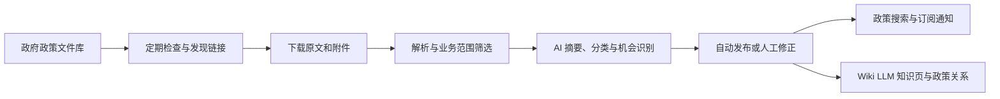

# 政策观察

面向水务、环保及“人工智能+”方向的政策发现、分析与订阅平台。系统定期检查政府政策文件库，保存政策原文及附件，提取摘要、分类和政策机会；正式发布后，用户可以搜索政策、订阅关心的主题并接收站内通知。

本仓库提供网页、API、后台任务及 Docker Compose 部署文件。默认部署适合**本机试用和受控内网验证**。首次启动使用全新 PostgreSQL 数据库，不附带管理员账号、演示政策或现成的政策数据。

## 功能概览



- **来源采集**：首次部署默认登记并启用[南宁市政策文件库](https://www.nanning.gov.cn/sousuo/zck/)。支持在网页调整检查计划、暂停来源和登记其他已支持的政策文件库。
- **政策处理**：保存原文和附件，提取政策摘要、文件类型、地域、业务领域、技术方向、政策效力与政策机会。AI 审核结果可由内部人员查看和修改。
- **搜索与订阅**：已发布的政策可按关键词、自然语言及结构化条件检索；用户无需订阅也能搜索正式政策库，订阅用于接收匹配通知。自然语言回答以库内真实政策为依据。
- **政策知识**：发布后的政策可参与 Wiki LLM 知识页综合和关系构建；内部人员可以查看证据并复核有争议的关系。
- **系统配置**：从管理页面设置政策文件库、分类和识别规则，以及不同用途的 AI 模型。

## 技术组成

| 组件 | 用途 |
| --- | --- |
| Next.js | 客户工作台和内部管理页面 |
| Django REST Framework | 用户、来源、政策、订阅及配置 API |
| PostgreSQL | 账号、政策、处理结果和业务配置 |
| Redis + Celery | 采集、解析、AI 审核及定时任务 |
| LangGraph | AI 分析流程及检查点 |
| OpenSearch（可选） | 全文检索索引；默认可使用数据库搜索 |
| 本地文件目录或对象存储 | 政策原文和附件 |

## 快速开始：从空数据库部署

### 1. 准备环境

安装并启动 Docker Desktop（Windows/macOS）或 Docker Engine（Linux），确认 `docker compose` 可用。还需要 Git 和 Python 3；Python 只用于生成本机配置、运行备份脚本，应用本身在容器里运行。首次构建需要下载镜像和依赖。

```bash
docker version
docker compose version
python --version
```

Windows 上如果 `python` 不可用，可将下文的 `python` 换为 `py`。

### 2. 获取代码并生成本机配置

```bash
git clone https://github.com/JiaHN213/policy-platform.git
cd policy-platform
python scripts/prepare_compose.py
```

脚本根据 [`.env.example`](.env.example) 生成 `.env.compose`，并为数据库和 Django 生成随机密钥。已有 `.env.compose` 时脚本不会覆盖它。

可以先不配置 AI，完成部署后再从网页配置。若希望尽快开始 AI 审核，可在 `.env.compose` 中填写模型服务信息：

```dotenv
AI_BASE_URL=https://api.deepseek.com
AI_API_KEY=你的密钥
AI_MODEL=你的模型名称
```

不同用途的模型还可以在“系统配置 → AI 模型与审核”中分别设置。没有可用模型时，采集和普通浏览仍可运行，AI 摘要、自动审核、自然语言归纳及知识综合等能力会受限。

本机使用 Ollama 时，容器中的 `localhost` 并不是你的电脑。在 Docker Desktop 中可将地址设为 `http://host.docker.internal:11434/v1`，模型名设为本机已安装的模型名，并填写一个非空的本地占位 `AI_API_KEY`；同时确认 Ollama 允许容器访问。Linux Docker Engine 需要先确保容器能解析并访问宿主机地址。模型地址、接口格式和可用性取决于你所使用的模型服务。

### 3. 启动服务

```bash
docker compose --env-file .env.compose config --quiet
docker compose --env-file .env.compose up --build -d
docker compose --env-file .env.compose ps
```

首次启动会构建镜像、创建 PostgreSQL 数据卷、执行数据库迁移，并登记**南宁市政策文件库**作为默认来源。该来源默认启用，检查间隔为 24 小时；后台定时服务启动后会安排首次检查。重复启动不会重复创建来源，也不会覆盖在网页中修改过的来源配置。采集进度取决于来源网站的可访问性和待处理文件量。

打开 [http://127.0.0.1:8080](http://127.0.0.1:8080)。接口健康状态可在 [http://127.0.0.1:8080/api/v1/health](http://127.0.0.1:8080/api/v1/health) 查看；正常时返回数据库已连接。默认 Compose 仅将网页端口绑定到本机，同事无法直接从局域网访问。

### 4. 创建管理员并登录

```bash
docker compose --env-file .env.compose exec api python apps/api/manage.py createsuperuser
```

按提示设置用户名、邮箱和密码，然后从网页的登录页进入。管理员可访问内部管理页面；普通客户可在登录页自主注册。首次部署**不会创建默认密码或演示账号**。

### 5. 从来源到第一条可搜索政策

1. 进入“系统配置 → 政策文件库”，确认南宁市政策文件库已启用，并按需要调整自动检查时间。
2. 进入“来源采集”，查看文件库检查、发现的链接、下载及解析状态。若来源网站不可访问，先解决网络问题再从网页重试。
3. 在“系统配置 → AI 模型与审核”填写并核对模型。进入“处理工作台”，点击“开始自动审核”；**网站启动不会自动开启 AI 审核**。
4. 在“处理工作台”查看 AI 处理结果。符合发布条件的政策会自动发布；资料或证据不足的文件可在此查看原因并修正。
5. 已发布政策会进入客户的“最新政策”和“政策搜索”。客户可以在“我的订阅”保存条件，并在“消息通知”查看匹配结果。

新数据库一开始没有政策，因此搜索为空是正常的。来源检查、解析、AI 审核与发布都完成后，才会出现正式搜索结果。政策关系和知识页属于发布后的后续处理。

## 页面导览

| 使用者 | 页面 | 主要用途 |
| --- | --- | --- |
| 客户 | `/search` 政策搜索 | 关键词、自然语言和条件检索正式政策 |
| 客户 | `/policies` 最新政策 | 浏览和筛选已发布政策 |
| 客户 | `/subscriptions` 我的订阅 | 设置地区、领域、类型、关键词等订阅条件 |
| 客户 | `/notifications` 消息通知 | 查看订阅匹配和提醒 |
| 内部人员 | `/admin/review` 处理工作台 | 启停 AI 自动审核、查看待处理文件、修正与发布 |
| 内部人员 | `/admin/sources` 来源采集 | 查看来源检查、链接发现、下载解析及失败原因 |
| 内部人员 | `/admin/data` 政策数据 | 维护政策机会、批次、效力及关系复审 |
| 内部人员 | `/admin/publication` 发布后处理 | 查看索引、通知和知识构建等后续任务 |
| 内部人员 | `/admin/knowledge` 政策知识库 | 阅读知识页、政策链与证据 |
| 内部人员 | `/admin/quality` 质量评测 | 检查分类、机会识别和引用质量 |
| 内部人员 | `/admin/configuration` 系统配置 | 设置文件库、检查计划、识别规则及 AI 模型 |

## 界面截图与功能说明

[点击查看系统界面展示](docs/界面展示.md)，浏览客户工作台、内部管理页面及各页面功能截图；也可以[查看 PDF 版本](docs/界面展示.pdf)。

API 文档位于 [http://127.0.0.1:8080/api/docs/](http://127.0.0.1:8080/api/docs/)。

## 常用配置

`.env.compose` 只保存在部署机器上。大部分业务设置可以在网页调整；修改环境变量后，重新启动相关容器使其生效。

| 设置 | 用途 | 首次部署建议 |
| --- | --- | --- |
| `POSTGRES_PASSWORD`、`DJANGO_SECRET_KEY` | 数据库及应用密钥 | 使用配置脚本生成，不要提交到 Git |
| `AI_BASE_URL`、`AI_API_KEY`、`AI_MODEL` | 默认模型服务 | 不用 AI 时可暂时留空；不同用途也可在网页设置 |
| `ORIGINAL_STORAGE_BACKEND` | 政策原件存储方式 | 默认 `local`，存入项目目录 `.local/originals` |
| `OPENSEARCH_ENABLED` | 是否启用 OpenSearch | 默认 `false`，先使用数据库搜索 |
| `POLICY_CRAWL_MIN_INTERVAL_SECONDS`、`POLICY_CRAWL_JITTER_SECONDS` | 对来源站点的请求间隔 | 保持默认限速，避免对来源造成过大压力 |
| `POLICY_CRAWL_PROXY_URL` | 特殊网络环境下的采集代理 | 仅在确有需要时设置 |
| `CSRF_TRUSTED_ORIGINS`、`DJANGO_ALLOWED_HOSTS` | 允许访问的域名 | 本机部署保留默认；换域名时同步调整 |

政策分类词典、业务范围和规则的代码基线位于 [`configs/`](configs/)；管理页面发布的修改会保存在数据库中。默认支持的来源采集类型有各自适配规则，新增其他政府网站前，应先确认系统是否支持该站点的页面结构。

### 可选：启用 OpenSearch

默认不需要 OpenSearch。需要单独的搜索索引时，将 `.env.compose` 中的 `OPENSEARCH_ENABLED` 设为 `true`，再运行：

```bash
docker compose --env-file .env.compose --profile search up --build -d
```

已有政策的索引可在管理页面检查和重建，后续发布内容由后台同步。

## 数据保存、更新与备份

| 数据 | 默认位置 | 是否上传 GitHub |
| --- | --- | --- |
| 账号、政策、配置和处理记录 | Docker 的 PostgreSQL 命名卷 | 否 |
| 任务队列状态 | Docker 的 Redis 命名卷 | 否 |
| 政策原文和附件 | 项目目录 `.local/originals` | 否 |
| OpenSearch 索引（启用时） | Docker 命名卷 | 否 |
| 内部 Obsidian 导出（启用时） | 项目目录 `output/obsidian-vault` | 否 |
| 本机配置和备份 | `.env.compose`、`.local/backups` | 否 |

`git clone` 只得到程序和配置模板，**不会带上他人的数据库、账号和政策原件**。普通停止、重启和重新构建不会清空数据库：

```bash
docker compose --env-file .env.compose down
docker compose --env-file .env.compose up -d
```

更新代码后：

```bash
git pull
docker compose --env-file .env.compose up --build -d
```

请勿用 `docker compose down --volumes` 作为普通重启方式；它会删除数据库等命名卷。`.local/originals` 是项目目录，不会随命名卷一起删除，清空数据库却保留原件会造成数据不一致。

### 备份与恢复

使用随仓库提供的脚本备份 PostgreSQL：

```bash
python scripts/compose_data.py backup
```

需要同时备份政策原文和附件时：

```bash
python scripts/compose_data.py backup --include-originals
```

完整备份会暂时停止 API 和后台写入，并复制可能较大的原件目录。备份位于 `.local/backups/docker`，不会进入 Git。可在临时数据库验证备份能否恢复：

```bash
python scripts/compose_data.py verify .local/backups/docker/20260928-120000-000000
```

恢复会替换当前业务数据库，请确认备份后再执行；脚本会先做回滚备份，并保留恢复前数据库：

```bash
python scripts/compose_data.py restore .local/backups/docker/20260928-120000-000000 --confirm
```

上面 `20260928-120000-000000` 是示例目录名，实际使用时替换为 `backup` 命令输出的目录名。可选的每日数据库备份服务：

```bash
docker compose --env-file .env.compose --profile backup up -d backup
```

自动备份默认保存在 `.local/backups/docker-auto`，不包含政策原件。正式使用时应将数据库备份和原件目录定期复制到部署机器以外的受控存储，并演练恢复。

## 开发方式

若要修改网页或 API，可使用开发模式。它与常规模式使用**同一套 Docker 数据库和政策原件**，前端和 API 会从本机源码运行：

```bash
docker compose --env-file .env.compose -f compose.yaml -f compose.dev.yaml up -d --build
```

继续访问 `http://127.0.0.1:8080`。网页和 API 源码修改后会重新加载；修改采集、Celery 任务或定时逻辑后重启后台服务：

```bash
docker compose --env-file .env.compose restart worker beat
```

修改 Django 数据模型时生成并应用迁移，再把迁移文件与代码一起提交：

```bash
docker compose --env-file .env.compose exec api python apps/api/manage.py makemigrations
docker compose --env-file .env.compose exec api python apps/api/manage.py migrate
```

依赖或 Docker 文件变更后重新执行带 `--build` 的启动命令。返回常规镜像模式可运行 `docker compose --env-file .env.compose up -d --build`。请避免同时维护另一套写入同一业务的独立数据库，以免数据分叉。

仓库的持续集成配置位于 [`.github/workflows/ci.yml`](.github/workflows/ci.yml)，检查 Python、API 契约以及前端类型、Lint 和构建。日常小改动可先运行与改动相关的检查。

## 常见问题

**网页打不开或显示“暂时无法连接工作台”**

先运行 `docker compose --env-file .env.compose ps`，确认 `postgres`、`init`、`api`、`web`、`nginx` 等服务状态。再查看日志：

```bash
docker compose --env-file .env.compose logs --tail=100 init postgres api web nginx
```

若健康接口不可用，先解决数据库或 API 启动错误。若 8080 端口已被其他程序占用，释放该端口后再启动。

**可以登录，但搜索不到政策**

全新数据库没有政策。先看“来源采集”是否发现并解析了文件，再确认“处理工作台”已配置模型、开启 AI 自动审核并完成发布。只有正式发布的政策才会出现在客户搜索中。

**南宁市文件库检查失败**

查看来源页面显示的具体原因。需要确认部署机器能访问政府网站；使用 VPN、代理或特殊 DNS 时，容器与浏览器的网络结果可能不同。调整网络或来源设置后再从网页重试。请保留采集间隔，不要通过高频请求绕过来源限制。

**AI 审核无法开始**

检查“系统配置 → AI 模型与审核”的地址、密钥、模型和启用状态，以及容器能否连接模型服务。配置成功后，仍需在“处理工作台”点击“开始自动审核”。

**改了网页代码，却还是旧页面**

确认当前使用的是开发模式；常规镜像模式需要重新执行 `up --build -d`。浏览器仍缓存旧资源时可刷新页面。
