## 客户工作台

### 统一政策搜索

按标题、文号、机构或政策内容查找政策，也可用自然语言描述想了解的问题。自然语言问题会先转成检索条件，从已发布政策中查询，再根据实际结果归纳。

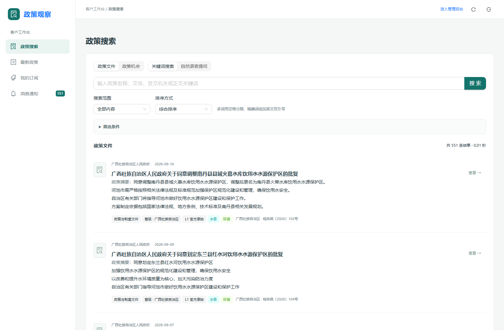

客户可以切换“政策文件”和“政策机会”视角，使用关键词或自然语言查询，选择排序方式并展开筛选条件。结果卡片展示摘要、地域、来源等级、业务领域和技术方向；打开详情后可继续阅读正文、附件和来源。

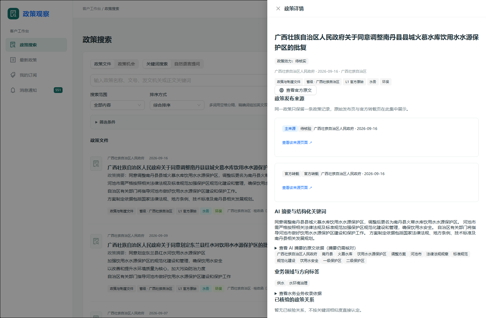

政策详情汇集发布来源、AI摘要与结构化关键词、领域标签、已核验关系、正文和附件入口。同一政策的官方原发页和转载来源在同一详情中展示。

### 浏览最新政策

集中浏览已正式发布的最新政策，并按主题、文件类型、业务领域、技术方向、政策效力和来源等条件筛选。

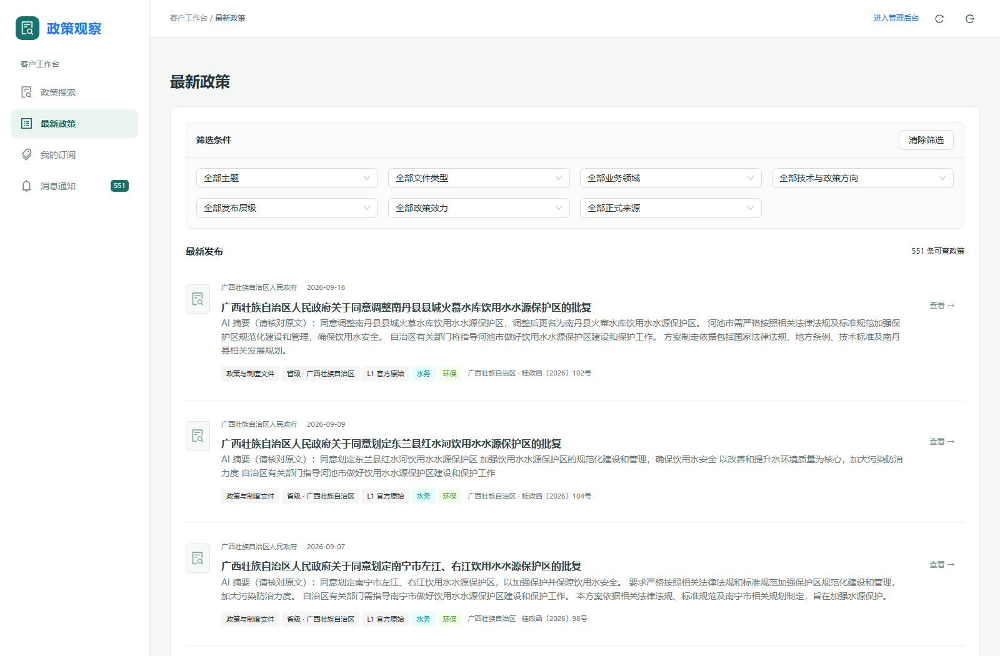

每条结果提供摘要和分类标签，方便判断是否值得进一步阅读。

### 建立个性化订阅

把关心的地区、行业领域、文件类型和关键词保存为订阅，让新发布且符合条件的政策主动进入个人消息。

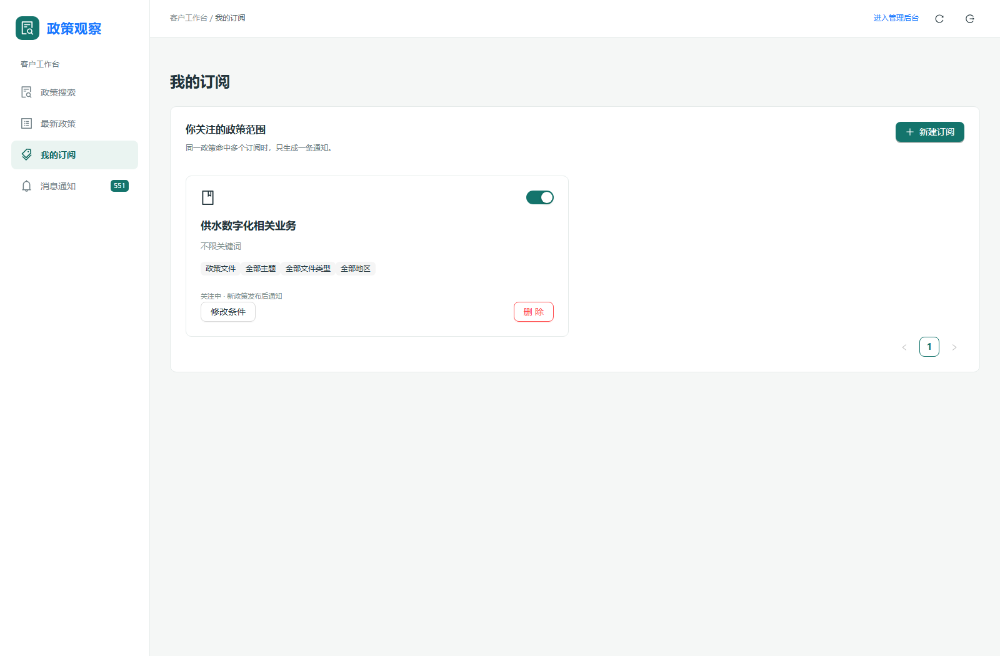

订阅可以选择政策文件、政策机会或两者，并按具体业务条件缩小范围。保存前可以预览匹配结果和命中原因；机会订阅可以设置申报截止提醒。

### 查看消息通知

在一个入口追踪新政策和订阅提醒，标记已读后直接打开对应政策。

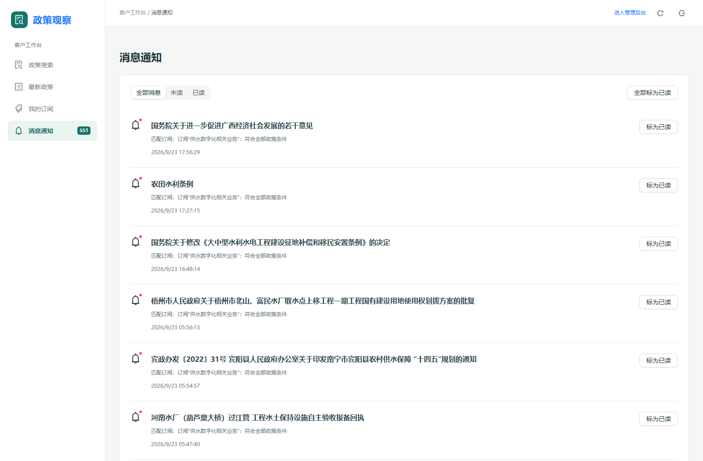

消息与政策详情相连，方便从提醒快速回到政策原文、适用范围和相关附件。当前展示的是站内通知流程。

## 内部运营与研究工作台

### 处理工作台：把注意力放在少量例外上

从采集、AI审核、人工处理到客户可见，查看政策处理进度；AI结果可直接流转，人工只需处理证据不足或字段异常的个案。

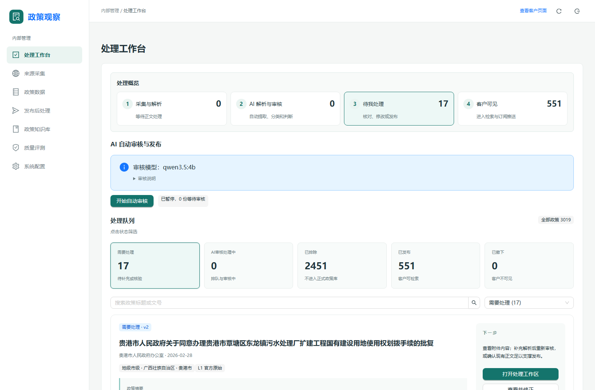

页面集中显示处理概览和待处理队列。工作人员可按状态、标题或文号筛选，打开处理工作区核对正文、附件、摘要和分类依据，局部修正AI结果、重试审核、发布或撤回政策。

### 来源采集：追踪来源和解析进度

集中查看政策文件库的检查状态、发现链接数量、待解析数量、入库情况和失败记录。

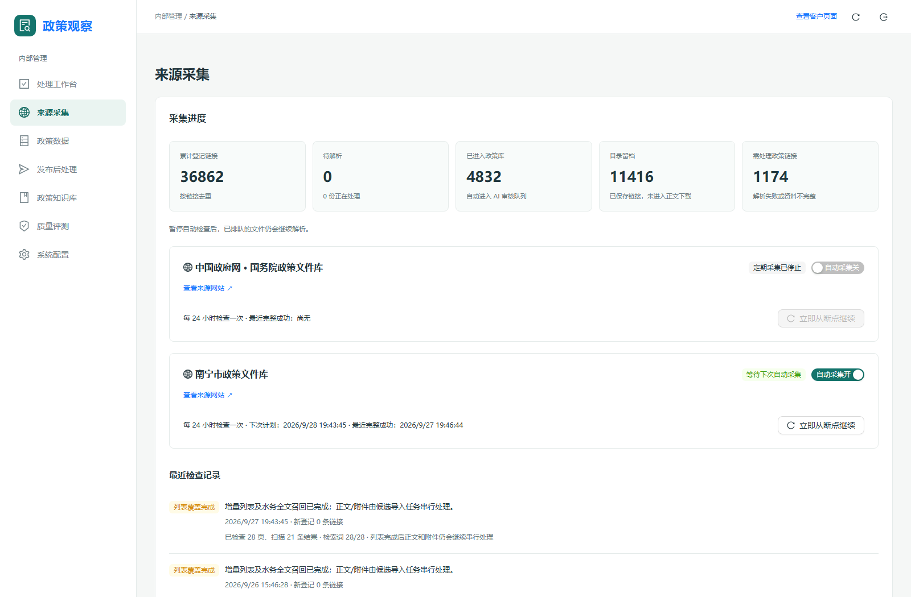

内部人员可以查看最近检查记录、暂停或恢复自动检查、从断点继续任务。遇到访问保护冷却或解析不完整时，页面提供状态和下一步提示。

### 政策数据：核对机会、效力和关系

将政策机会、申报批次、政策效力变化和关系人工复审放在政策数据工作区集中维护。

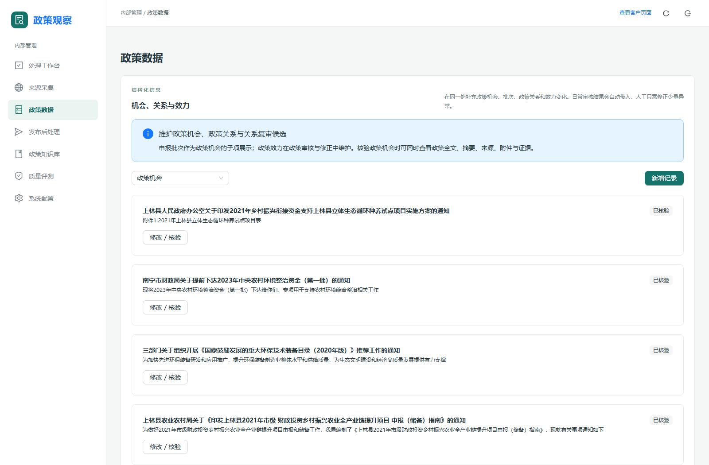

工作人员可以基于政策全文核对支持对象、申报状态、时间和引用依据。Wiki LLM 自动发现的关系若未通过方向或原文证据校验，会进入人工复审；确认后才能作为已核验关系使用。搜索索引日常自动同步，完整重建属于维护操作。

### 发布后处理：确认发布结果已到达各环节

一份政策发布后，搜索、订阅通知、Wiki知识构建和统计审计分别记录处理状态。

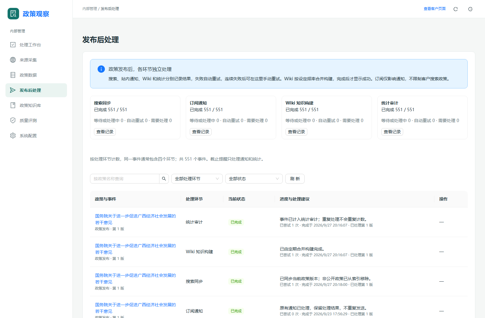

工作人员可以按政策、环节和状态查找记录，查看中文失败原因及重试状态。

### 政策知识库：阅读跨文件知识与证据

将多份正式政策综合为政策链、主题和地区知识页，重要结论附上对应政策和原文引用。

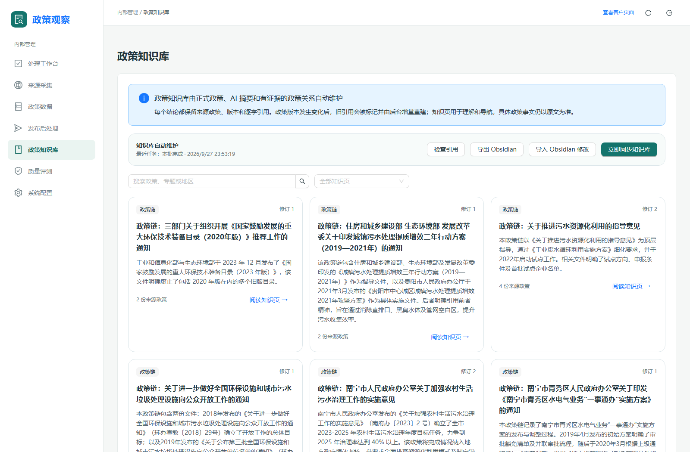

内部研究人员可以搜索并阅读知识页、检查引用、同步更新内容，或与中文 Obsidian Vault 进行受控导出和导入。知识页帮助理解政策脉络；具体政策事实仍以引用的官方原文为准。

### 质量评测：用真实样本持续改善判断

对政策机会、政策关系和知识页样本进行人工标注，让识别效果可以衡量、问题可以追踪。

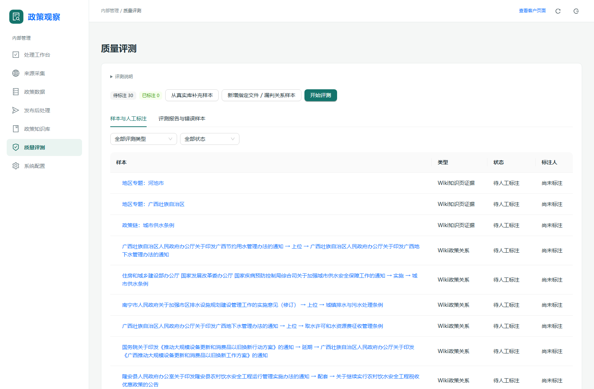

可阅读原文和附件，保存人工标准答案及逐字证据，再查看准确率、精确率、召回率、漏判率、误报率和引用支持度。没有人工标注时不虚构准确率；发现共性错因后，可回到配置中心调整规则并用新样本复评。

## 面向业务人员的配置中心

不同配置分别服务于来源管理、业务判断和模型运行；调整规则可以先保存为草稿，确认后再发布。

### 文件库与检查计划

维护已经支持的政策来源、检查方式和自动检查计划。

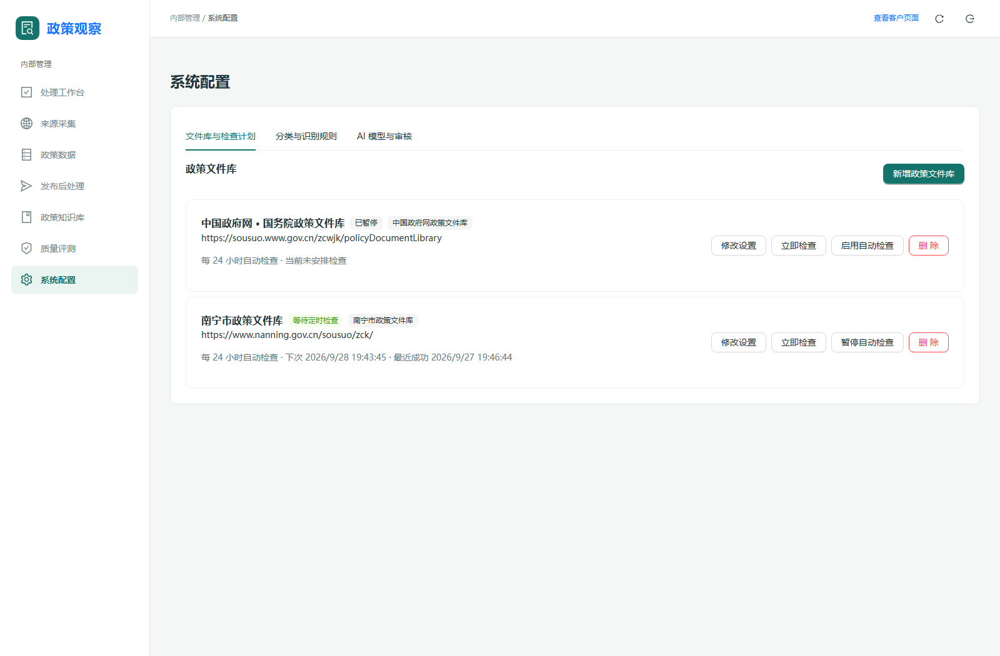

可查看来源状态、网址、下次检查时间和最近成功情况，也可新增已支持类型的文件库、立即检查或暂停自动检查。新增网站若结构不同，需要先增加并验证对应采集规则。

### 分类与识别规则

用结构化的业务配置维护分类、领域、方向标签和识别规则，支持后续增删改查及版本发布。

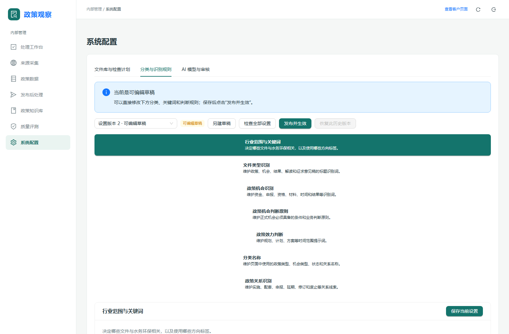

分类和辅助词典帮助系统判断政策是否与水务环保相关、属于哪类文件、是否包含正式政策机会。草稿修改不会自动改变当前运行规则，发布时再纳入后续任务。

### AI模型与审核

按AI工作用途配置服务地址、模型和并发数，让摘要审核、政策知识等任务可以分别选择适用模型。

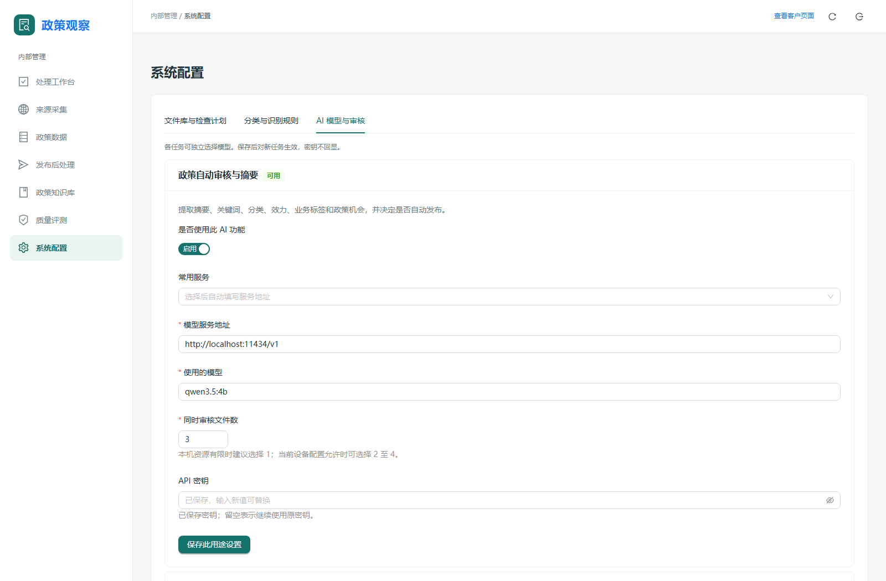

模型服务设置集中管理；API密钥以受保护方式填写和保存。并发数应根据本机或模型服务的实际资源设置，避免请求太多导致排队、超时或服务不稳定。